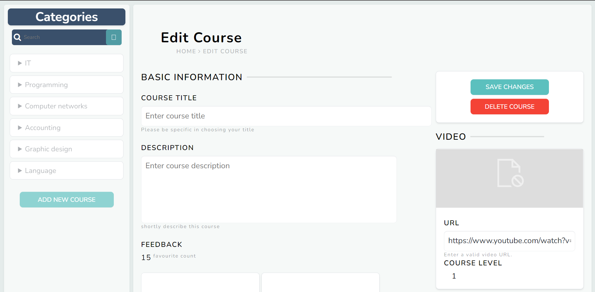

# Frontend Mentor - StandBy Admin Panel

this is an admin page in a learning websites (StandBy) in a static way

## Table of contents

- [Overview](#overview)
  - [Screenshot](#screenshot)
  - [Links](#links)
  - [Built with](#built-with)
  - [Continued development](#continued-development)
  - [Useful resources](#useful-resources)
- [Author](#author)
- [Acknowledgments](#acknowledgments)

## Overview

### Screenshot

### Links

- Solution URL: [admin-panal](https://amrewais.github.io/admin-panel/)

### Built with

- Semantic HTML5 markup
- CSS custom properties
- Flexbox
- CSS Grid

### Continued development

why not!!

### Useful resources

- [flex](https://css-tricks.com/almanac/properties/f/flex/)
- [Flexible_Box_Layout](https://developer.mozilla.org/en-US/docs/Web/CSS/CSS_Flexible_Box_Layout/Controlling_Ratios_of_Flex_Items_Along_the_Main_Ax#a_first_look)

## Author

- github - [AmrEwais](https://github.com/AmrEwais)

## Acknowledgments

hat tip to [@omarYasserM](https://github.com/omarYasserM)
